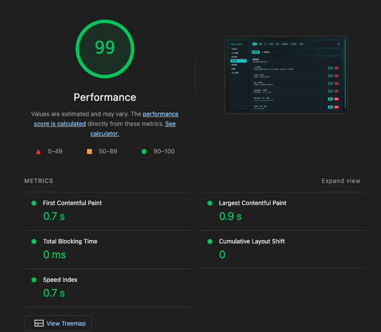
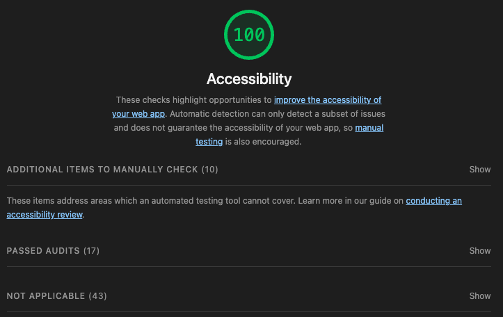

# mioku-webui

</img> 

Mioku 的前端管理界面

## 技术栈

- Vite
- React
- TailwindCSS
- bun

## 开发

```bash
bun install
bun run dev
```

默认开发地址：`http://localhost:5178`

## 构建

```bash
bun run build
```

构建产物输出到：

`../src/services/webui/dist`

## 性能




